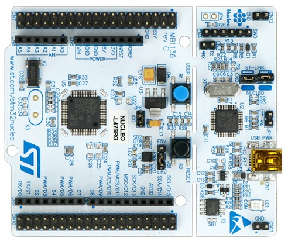
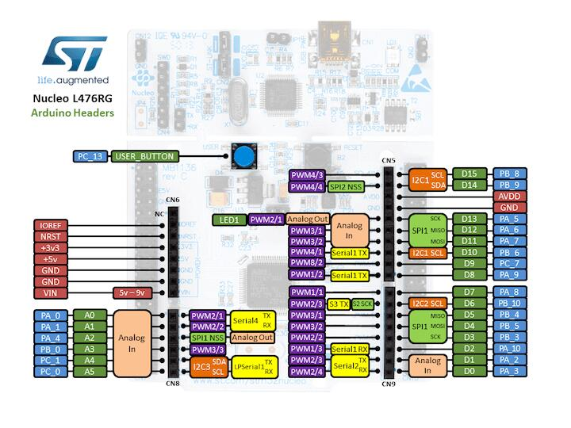
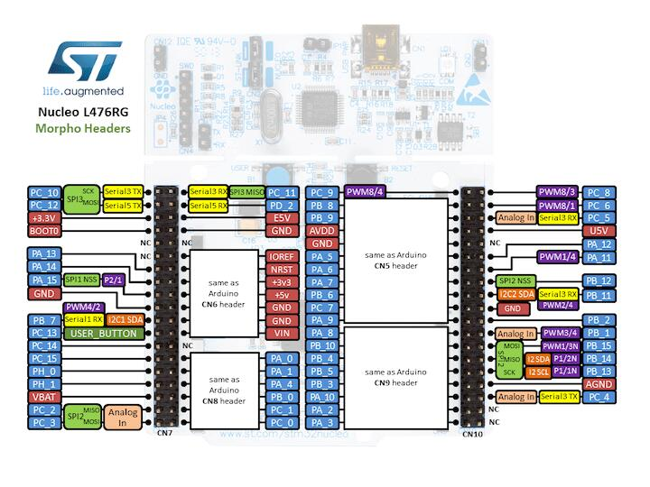

# ST Nucleo-L476RG

## Overview

The STM32 Nucleo-64 board provides an affordable and flexible way for users to try out new concepts and build prototypes by choosing from the various combinations 
of performance and power consumption features, provided by the STM32 microcontroller. For the compatible boards, the external SMPS significantly reduces power consumption 
in Run mode. The ARDUINO® Uno V3 connectivity support and the ST morpho headers allow the easy expansion of the functionality of the STM32 Nucleo open development platform 
with a wide choice of specialized shields. The STM32 Nucleo-64 board does not require any separate probe as it integrates the ST-LINK debugger/programmer. 
The STM32 Nucleo-64 board comes with the STM32 comprehensive free software libraries and examples available with the STM32Cube MCU Package.

> **Note:** 
> Into \Documents\NUCLEO-L476RG_de\Binary you can find a hex ready to load into L476RG demo board. Although this demo uses an Adafruit 1.8" TFT shield, it could be run without 
> it as a board sanity check (User LED LD2 will blink). To load this hex you should use STM32Cube programmer.

## Hardware

The board features the following elements:

+ Microcontroller STM32L476RGTx
+ On-board ST-LINK/V2-1 
+ USB VBUS, ext. VIN, ext. 5V, ext +3.3V 
+ STMicroelectronics Morpho connector : (2 x 38) 
+ STMicroelectronics Arduino Uno Rev3 connector : 10 + (2 x 8) + 6 
+ 2 Push-buttons: User (Blue) and Reset (Black) 
+ 3 LEDs: COM, Power, User LED (Only one is programmable)

## Software requirements
+ IDE: STM32Cube IDE
+ Programmer: STM32Cube Programmer
+ Code Generator: STM32Cube MX (https://www.st.com/content/st_com/en/stm32cubemx.html)
+ MCU Package: STM32Cube MCU Package for STM32L4 series

## References
+ Reference Manual for STM32L47x - https://www.st.com/resource/en/reference_manual/DM00083560-.pdf
+ STM32L476RG Product Overview - https://www.st.com/en/microcontrollers-microprocessors/stm32l476rg.html
+ Board Schematics - https://www.st.com/en/evaluation-tools/nucleo-l476rg.html#cad-resources
